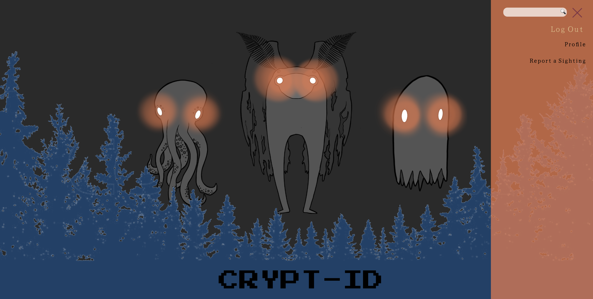

# Cryptid 2.0

  ## Table of Contents

  * [Description](#description)

  * [Installation](#installation)

  * [Tools](#tools)

  * [Contributing](#contributing)

  * [Screenshot](#screenshot)

  ## Description:
    Cryptid 2.0 is a full-stack MERN application that allows user to create posts to report on the latest sightings and theories of cryptids, UFOs, and the paranormal. User are able to create, edit and delete post as well as view reports that others have made based on category. 

  ## Installation:
    * [Deployed Site](https://calm-tundra-54931.herokuapp.com/)
    * [GitHub Repository](https://github.com/eliselabonte/cryptid2)

  ## Tools
     React 
     Typescript
     Auth0
     Bootstrap
     MySQL
     Express

  ## Contributing:
    [Ryan Dupont](https://www.github.com/rdupont1623)
    [Elise LaBonte](https://www.github.com/eliselabonte)
    [Stevanie Kanter](https://www.github.com/stevaniekanter)
    [Nick Zabkar](https://www.github.com/CIDoubleAgent)
